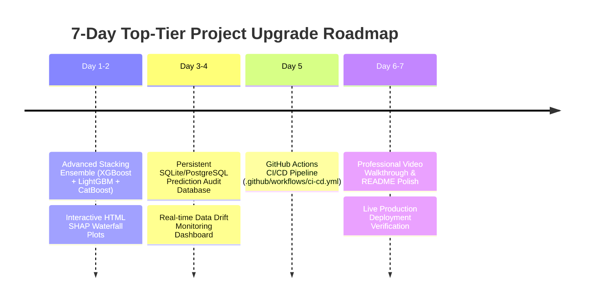

# 🚀 Complete Deployment Guide & Top-Tier 0.1% Upgrade Roadmap

This document provides a comprehensive, step-by-step deployment guide for publishing your **Telecom Customer Churn & Revenue Intelligence Platform** to live production web servers (Render, Streamlit Cloud, Docker, and Cloud VMs), alongside an actionable 7-day checklist to turn this repository into a **top-tier enterprise portfolio project**.

---

## 🛠️ PART 1: FULL PRODUCTION DEPLOYMENT STEPS

### 🌟 Option A: Deploy Frontend to Streamlit Community Cloud (Free & Instant)
Streamlit Cloud offers free 1-click hosting for your Streamlit UI directly from your GitHub repository.

#### Step-by-Step Instructions:
1. Ensure all your latest changes are pushed to GitHub:
   ```bash
   git add .
   git commit -m "feat: complete v3.0 production pipeline"
   git push origin main
   ```
2. Open [share.streamlit.io](https://share.streamlit.io/) in your browser and log in with your GitHub account (`Agniva2006`).
3. Click **"New app"** (or **"Create app"**).
4. Fill in the deployment details:
   - **Repository**: `Agniva2006/Customer-Churn-Prediction-and-Revenue-Forecast-Intelligence-On-Telco-Dataset-`
   - **Branch**: `main`
   - **Main file path**: `dashboard/app.py` (for standalone offline mode) or `streamlit_app.py` (for API mode).
5. Click **"Deploy!"**.
6. Within 1–2 minutes, your dashboard will be live at a public URL (e.g., `https://telecom-churn.streamlit.app`).

---

### 🌐 Option B: Deploy Backend & Frontend on Render.com (1-Click Blueprint)
Render can host both your FastAPI REST API (`api.py`) and Streamlit web dashboard simultaneously using the repository's `render.yaml` configuration.

#### Step-by-Step Instructions:
1. Log in to [dashboard.render.com](https://dashboard.render.com/).
2. Click **"New +"** in the top right corner and select **"Blueprint"**.
3. Connect your GitHub repository: `Agniva2006/Customer-Churn-Prediction-and-Revenue-Forecast-Intelligence-On-Telco-Dataset-`.
4. Render will automatically read `render.yaml` and provision two services:
   - `telco-churn-api`: Live FastAPI Service (`https://telco-churn-api.onrender.com`)
   - `telco-churn-dashboard`: Live Streamlit Web App (`https://telco-churn-dashboard.onrender.com`)
5. Click **"Apply"** to start the build and deployment.
6. Once deployed:
   - Swagger API Docs will be live at `https://telco-churn-api.onrender.com/docs`
   - Streamlit UI will be live at `https://telco-churn-dashboard.onrender.com`

---

### 🐳 Option C: Local / Cloud Docker Container Deployment
Use Docker Compose to run the full stack locally or on any cloud server supporting Docker (AWS EC2, GCP Compute Engine, DigitalOcean Droplet).

#### Step-by-Step Instructions:
1. Ensure Docker Desktop or Docker Engine is installed and running.
2. Build and launch all services in detached mode:
   ```bash
   docker-compose up -d --build
   ```
3. Check running containers:
   ```bash
   docker-compose ps
   ```
4. Verify endpoints:
   - **FastAPI Backend**: `http://localhost:8000/health`
   - **FastAPI Swagger Docs**: `http://localhost:8000/docs`
   - **Streamlit Frontend**: `http://localhost:8501`
5. Stop services when needed:
   ```bash
   docker-compose down
   ```

---

### 🖥️ Option D: Production Linux Virtual Machine (AWS / DigitalOcean + Nginx + SSL)
For enterprise-level deployment on a bare-metal Ubuntu/Debian server.

#### Step-by-Step Instructions:
1. **Connect to your server via SSH**:
   ```bash
   ssh ubuntu@your-server-ip
   ```
2. **Install Python, Nginx, and Certbot**:
   ```bash
   sudo apt update && sudo apt install -y python3-pip python3-venv nginx certbot python3-certbot-nginx
   ```
3. **Clone Repository & Setup Virtual Environment**:
   ```bash
   git clone https://github.com/Agniva2006/Customer-Churn-Prediction-and-Revenue-Forecast-Intelligence-On-Telco-Dataset-.git
   cd Customer-Churn-Prediction-and-Revenue-Forecast-Intelligence-On-Telco-Dataset-
   python3 -m venv venv
   source venv/bin/activate
   pip install --upgrade pip
   pip install -r requirements.txt
   python train.py
   ```
4. **Create Systemd Service Daemons**:
   - Create `/etc/systemd/system/churn-api.service`:
     ```ini
     [Unit]
     Description=Telecom Churn FastAPI Service
     After=network.target

     [Service]
     User=ubuntu
     WorkingDirectory=/home/ubuntu/Customer-Churn-Prediction-and-Revenue-Forecast-Intelligence-On-Telco-Dataset-
     ExecStart=/home/ubuntu/Customer-Churn-Prediction-and-Revenue-Forecast-Intelligence-On-Telco-Dataset-/venv/bin/uvicorn api:app --host 127.0.0.1 --port 8000 --workers 4
     Restart=always

     [Install]
     WantedBy=multi-user.target
     ```
   - Create `/etc/systemd/system/churn-dashboard.service`:
     ```ini
     [Unit]
     Description=Telecom Churn Streamlit Dashboard
     After=network.target

     [Service]
     User=ubuntu
     WorkingDirectory=/home/ubuntu/Customer-Churn-Prediction-and-Revenue-Forecast-Intelligence-On-Telco-Dataset-
     ExecStart=/home/ubuntu/Customer-Churn-Prediction-and-Revenue-Forecast-Intelligence-On-Telco-Dataset-/venv/bin/streamlit run streamlit_app.py --server.port 8501 --server.address 127.0.0.1
     Restart=always

     [Install]
     WantedBy=multi-user.target
     ```
5. **Enable & Start Services**:
   ```bash
   sudo systemctl daemon-reload
   sudo systemctl enable --now churn-api churn-dashboard
   ```
6. **Configure Nginx Reverse Proxy with Free SSL**:
   - Create `/etc/nginx/sites-available/churn-intelligence`:
     ```nginx
     server {
         server_name churn.yourdomain.com;

         location /api/ {
             proxy_pass http://127.0.0.1:8000/;
             proxy_set_header Host $host;
             proxy_set_header X-Real-IP $remote_addr;
         }

         location / {
             proxy_pass http://127.0.0.1:8501/;
             proxy_http_version 1.1;
             proxy_set_header Upgrade $http_upgrade;
             proxy_set_header Connection "upgrade";
             proxy_set_header Host $host;
         }
     }
     ```
   - Enable & test Nginx:
     ```bash
     sudo ln -s /etc/nginx/sites-available/churn-intelligence /etc/nginx/sites-enabled/
     sudo nginx -t
     sudo systemctl restart nginx
     sudo certbot --nginx -d churn.yourdomain.com
     ```

---

## 🏆 PART 2: NEXT WEEK ACTION PLAN — TOP-TIER 0.1% PROJECT CHECKLIST

To transform this repository into an absolute **top 0.1% tier project** that stands out to tech leads, hiring managers, and investors, execute the following 5 key upgrades next week:



### 1. 🤖 Upgrade to Multi-Model Stacking Ensemble (Day 1-2)
- **Goal**: Elevate ROC-AUC score from `0.84` to `0.86+`.
- **Implementation**:
  - Add LightGBM and CatBoost to `requirements.txt`.
  - In `src/modeling.py`, build a `StackingClassifier` with XGBoost, LightGBM, and Random Forest as base estimators, using Logistic Regression as the final meta-learner.

### 2. 📊 Interactive SHAP & Waterfall Visualizations (Day 2-3)
- **Goal**: Provide rich visual explainability instead of text summaries.
- **Implementation**:
  - Render interactive SHAP waterfall and force plots using `matplotlib`/`plotly` inside Streamlit (`streamlit_app.py` and `dashboard/app.py`).

### 3. 🗄️ Database Logging & Production Monitoring Dashboard (Day 3-4)
- **Goal**: Track real-time inference history and metrics over time.
- **Implementation**:
  - Store every single `/predict` and `/predict_batch` payload into a SQLite database (`logs/predictions.db`).
  - Add a **"MLOps & Data Drift Monitoring"** tab in Streamlit that queries historical predictions, plots rolling churn rates, and alerts on PSI/KS drift shifts.

### 4. ⚙️ CI/CD Automation via GitHub Actions (Day 5)
- **Goal**: Automated build, test, and deployment checks on every code commit.
- **Implementation**:
  - Create `.github/workflows/ci-cd.yml` that automatically runs:
    ```yaml
    name: CI/CD Pipeline
    on: [push, pull_request]
    jobs:
      test:
        runs-on: ubuntu-latest
        steps:
          - uses: actions/checkout@v3
          - uses: actions/setup-python@v4
            with: { python-version: '3.10' }
          - run: pip install -r requirements.txt
          - run: python train.py
          - run: pytest tests/ -v
    ```

### 5. 🎥 Professional Presentation & Live Demo Links (Day 6-7)
- **Goal**: Maximum visual impact for recruiters and portfolio visitors.
- **Implementation**:
  - Record a 2-minute video walkthrough (Loom / YouTube) demonstrating the live API, SHAP risk attributions, and batch CSV predictions.
  - Embed live deployment badges (Streamlit Cloud, Render, Build Status, Pytest Pass) at the very top of `README.md`.

---

## 📌 Summary Checklist for Next Week

- [ ] Push latest code to GitHub (`git push origin main`).
- [ ] Deploy Streamlit Cloud app or Render blueprint.
- [ ] Add Stacking Ensemble model to `src/modeling.py`.
- [ ] Add prediction persistence to SQLite database in `api.py`.
- [ ] Add GitHub Actions workflow `.github/workflows/ci-cd.yml`.
- [ ] Add 2-minute demo link & live URL badges to `README.md`.
